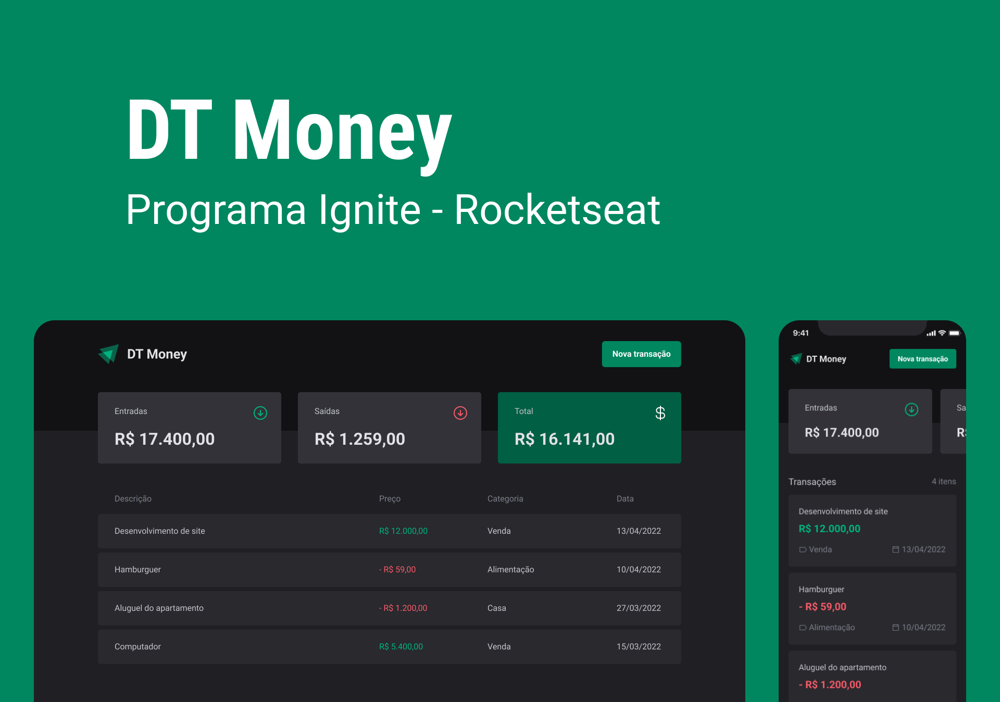

<div align="center" style="margin-bottom: 20px;">

</div>

<div align="center" style="margin: 20px;">


</div>

## 🔥 Preview

<div align="center">

</div>

## 💈 O projeto

Consumo de API e performance no ReactJS: 
Aplicação front-end web completa, conectando a uma API e veremos como performar aplicações com o React entendendo como funcionam os algoritmos internos da biblioteca e todo fluxo de renderização de componentes.

### 🚀 Tecnologias utilizadas

O projeto foi feito com as seguintes tecnologias:

- [ReactJS](https://pt-br.reactjs.org/)
- [Styled-Components](https://styled-components.com/)
{...}

### ℹ️ Como usar

```zsh
# Clone this repository
$ git clone https://github.com/LeonardoBrizolla/dt-money

# Go into the repository
$ cd dt-money

# Install dependencies
$ npm install

# Run the app
$ npm run dev
```

<p align="center" style="margin-top: 20px; border-top: 1px solid #eee; padding-top: 20px;">Feito com ❤️ by <strong> Leonardo Brizolla </p>
